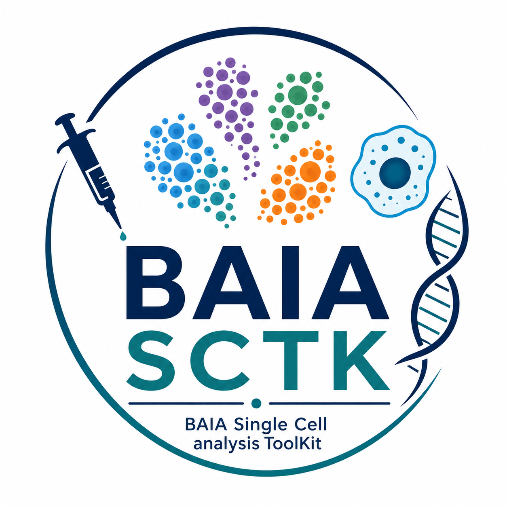

<table>
<tr>
<td width="400" valign="top"></td>
<td valign="top">
<h1>BAIA Single Cell analysis ToolKit (BAIA-SCTK)</h1>
<p>The <strong>BAIA Single Cell analysis ToolKit</strong> is a collection of interoperable R packages developed by the Bioinformatics and AI Applications (BAIA) Unit at the Institut Pasteur du Cambodge. The toolkit supports common single-cell RNA-seq analyses through a set of modular packages that can be used independently or combined into larger workflows.</p>
</td>
</tr>
</table>

## Repository Overview

| Package                                                                        | Description                                                                                        |
| ------------------------------------------------------------------------------ | -------------------------------------------------------------------------------------------------- |
| [baia-seurat-helpers](https://github.com/baia-ipc/baia-seurat-helpers)         | Utilities for Seurat-based preprocessing, metadata management, visualization, and quality control. |
| [baia-ext-cellprop-plots](https://github.com/baia-ipc/baia-ext-cellprop-plots) | Publication-quality cell composition and cell proportion analyses.                                 |
| [baia-cellchat](https://github.com/baia-ipc/baia-cellchat)                     | Simplified CellChat workflows for cell-cell communication analysis.                                |
| [baia-pathway-analysis](https://github.com/baia-ipc/baia-pathway-analysis)     | Functional enrichment and pathway analysis tools for differential expression results.              |
| [baia-pseudobulk-deseq](https://github.com/baia-ipc/baia-pseudobulk-deseq)     | Pseudobulk differential expression workflows based on DESeq2.                                      |

---

## Modular Design

The toolkit is modular.
Some packages are commonly used together, while others can be applied independently depending on the biological question being addressed.

```text
                               ┌─────────────────────┐
                               │ baia-seurat-helpers │
                               └──────────┬──────────┘
                                          │
             ┌────────────────────────────┼────────────────────────────┐
             │                            │                            │
             ▼                            ▼                            ▼

┌─────────────────────┐      ┌─────────────────────┐      ┌─────────────────────┐
│ Cell Composition    │      │ Differential        │      │ Cell Communication  │
│ Analysis            │      │ Expression          │      │ Analysis            │
│                     │      │                     │      │                     │
│ baia-ext-           │      │ baia-pseudobulk-    │      │ baia-cellchat       │
│ cellprop-plots      │      │ deseq               │      │                     │
└─────────────────────┘      └──────────┬──────────┘      └─────────────────────┘
                                         │
                                         ▼
                           ┌─────────────────────────┐
                           │ Pathway Enrichment      │
                           │                         │
                           │ baia-pathway-analysis  │
                           └─────────────────────────┘
```

---

## Use Cases

### Cell Type Composition

Compare cell populations between conditions, cohorts, or time points.

Repository:

* [baia-ext-cellprop-plots](https://github.com/baia-ipc/baia-ext-cellprop-plots)

Typical input:

* Seurat object with annotated cell types

Outputs:

* Stacked barplots
* Proportion plots
* Statistical comparisons

---

### Differential Expression and Functional Interpretation

Identify transcriptional changes and their biological implications.

Repositories:

* [baia-pseudobulk-deseq](https://github.com/baia-ipc/baia-pseudobulk-deseq)
* [baia-pathway-analysis](https://github.com/baia-ipc/baia-pathway-analysis)

Typical workflow:

```text
Seurat object
      ↓
Pseudobulk DESeq2
      ↓
Differentially expressed genes
      ↓
Pathway enrichment
```

However, `baia-pathway-analysis` can also be used independently with differential expression results generated by other tools.

---

### Cell–Cell Communication

Study signaling interactions between cell populations.

Repository:

* [baia-cellchat](https://github.com/baia-ipc/baia-cellchat)

Typical input:

* Annotated Seurat object

Outputs:

* Interaction networks
* Signaling pathway analyses
* Comparative communication analyses

This package can be used independently of the differential expression and pathway-analysis workflows.

---

### Seurat Workflow Support

Repository:

* [baia-seurat-helpers](https://github.com/baia-ipc/baia-seurat-helpers)

Provides utility functions that simplify common Seurat operations and serve as a foundation for many downstream analyses.

---

## Design Principles

* Modular architecture
* Reproducible workflows
* Compatibility with Seurat v5
* Transparent statistical methods
* Support for scalable and collaborative single-cell analysis

---

## Installation

Each package can be installed independently.

```r
remotes::install_github("baia-ipc/baia-seurat-helpers")
remotes::install_github("baia-ipc/baia-ext-cellprop-plots")
remotes::install_github("baia-ipc/baia-cellchat")
remotes::install_github("baia-ipc/baia-pathway-analysis")
remotes::install_github("baia-ipc/baia-pseudobulk-deseq")
```

See the individual repositories for package-specific documentation and examples.

---

## About BAIA

The BAIA Unit develops open-source software supporting:

* Single-cell transcriptomics and Immune bioinformatics
* Viral genomics and metagenomics
* Malaria bioinformatics
* AI-assisted qualitative research data analysis

GitHub Organization: [github.com/baia-ipc](https://github.com/baia-ipc)
